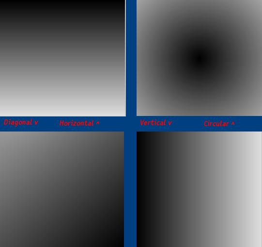

<div align="center">

## Must SEE\!\!\! Make all kinds of gradients, including DIAGONAL\!


</div>

### Description

Look at the screen shot for all the possible gradients. You can choose the color, kind, and the end color. Worth checking out!
 
### More Info
 


<span>             |<span>
---                |---
**Submitted On**   |
**By**             |[CoDe ReD CrYsTaL](https://github.com/Planet-Source-Code/PSCIndex/blob/master/ByAuthor/code-red-crystal.md)
**Level**          |Advanced
**User Rating**    |3.7 (11 globes from 3 users)
**Compatibility**  |VB 6\.0
**Category**       |[Graphics](https://github.com/Planet-Source-Code/PSCIndex/blob/master/ByCategory/graphics__1-46.md)
**World**          |[Visual Basic](https://github.com/Planet-Source-Code/PSCIndex/blob/master/ByWorld/visual-basic.md)
**Archive File**   |[](https://github.com/Planet-Source-Code/code-red-crystal-must-see-make-all-kinds-of-gradients-including-diagonal__1-29588/archive/master.zip)

### API Declarations

All coding by hand


### Source Code

```
'Make all kinds of gradients
Function GradientMake(red As Integer, blue As Integer, green As Integer, endcolor As Integer, fill As Integer, Optional X As Integer, Optional Y As Integer)
 'The object- tested with picture boxes too
 Set gradienta = Me
 'Choose the fill type
 Select Case fill
  'Horizontal
  Case 1
   'Draw a line with color decreasing each time
   For i = 0 To gradienta.ScaleHeight - 1
    'This chooses the color decrease amount
    grcomponent = i * endcolor / gradienta.ScaleHeight
    'This chooses the color for the line
    rgbcolor = RGB(grcomponent + red, grcomponent + green, grcomponent + blue)
    'Draw the next line
    gradienta.Line (0, i)-(gradienta.ScaleWidth - 1, i), rgbcolor
   'Now get ready for the next line
   Next
  'Vertical
  Case 2
   'Draw a line with color decreasing each time
   For i = 0 To gradienta.ScaleWidth - 1
    'This chooses the color decrease amount
    grcomponent = i * endcolor / gradienta.ScaleWidth
    'This chooses the color for the line
    rgbcolor = RGB(grcomponent + red, grcomponent + green, grcomponent + blue)
    'Draw the next line
    gradienta.Line (i, 0)-(i, gradienta.ScaleWidth - 1), rgbcolor
   'Now get ready for the next line
   Next
  'Circular
  Case 3
   'If no optional Y then set it to the middle
   If Y = 0 Then Y = gradienta.ScaleHeight / 2
   'If no optional X then set it to the middle
   If X = 0 Then X = gradienta.ScaleWidth / 2
   'if there was an optional X then set the difference so the gradient takes up the area used
   If X <> (gradienta.ScaleWidth / 2) Then xx = X + ((gradienta.ScaleHeight / 2) - X)
   'if there was an optional Y then set the difference so the gradient takes up the area used
   If Y <> (gradienta.ScaleHeight / 2) Then xy = Y + ((gradienta.ScaleWidth / 2) - Y)
   'Draw a circle with color decreasing each time
   For i = 0 To gradienta.ScaleHeight + xx + xy
    'This chooses the color decrease amount
    grcomponent = i * endcolor / gradienta.ScaleHeight
    'This chooses the color for the line
    rgbcolor = RGB(grcomponent + red, grcomponent + green, grcomponent + blue)
    'Draw the next circle
    gradienta.Circle (X, Y), i, rgbcolor
   'Now get ready for the next circle
   Next
  Case 4
   'initialize xx
   xx = 1
   'Use pathagrian's therom to find the diaginal of the area used
   pathagrian = Sqr((gradienta.ScaleHeight * gradienta.ScaleHeight) + (gradienta.ScaleWidth * gradienta.ScaleWidth))
   'Draw a line with color decreasing each time
   For i = 0 To pathagrian
    'set the X point for the diganal line
    xc = (gradienta.ScaleWidth - i) * 2
    'set the Y point for the diganal line
    xd = (gradienta.ScaleHeight - i) * 2
    'This chooses the color decrease amount
    grcomponent = i * endcolor / pathagrian
    'This chooses the color for the line
    rgbcolor = RGB(grcomponent + red, grcomponent + green, grcomponent + blue)
    'Draw the next line
    gradienta.Line (xc, 0)-(0, xd), rgbcolor
   'Now get ready for the next line
   Next
 'end the select case for the fill type
 End Select
End Function
```

